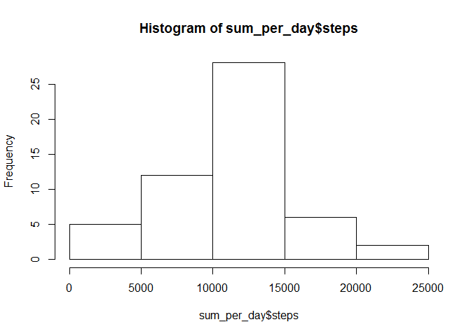
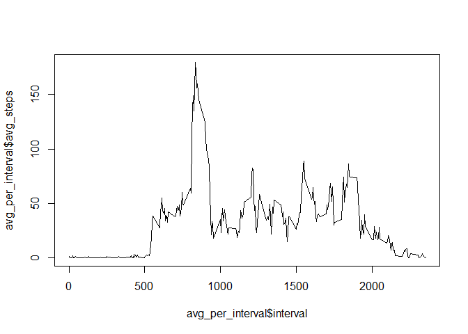

# Reproducible Research: Peer Assessment 1


## Loading and preprocessing the data


```r
library(ggplot2)
data <- read.table(unz("activity.zip", "activity.csv"), header=T, sep=",")
num_intervals <- length(unique(data$interval))
num_dates <- length(unique(data$date))
```

## What is mean total number of steps taken per day?

#### Frequency of total number of steps taken every day


```r
data_no_na <- data[!is.na(data$steps),]
sum_per_day <- aggregate(steps ~ date, data=data_no_na, FUN=sum)

hist(sum_per_day$steps)
```

 


#### Mean of the number of steps taken every day 
 

```r
mean(sum_per_day$steps)
```

```
## [1] 10766
```
 
#### Median of the number of steps taken every day 
 

```r
median(sum_per_day$steps)
```

```
## [1] 10765
```


## What is the average daily activity pattern? 


```r
avg_per_interval <- aggregate(steps ~ interval, data=data_no_na, FUN=sum)
avg_per_interval$avg_steps <- avg_per_interval$steps / num_dates

plot(avg_per_interval$interval,avg_per_interval$avg_steps, type="l")
```

 

### Interval with the maximum number of steps (on average)


```r
avg_per_interval$interval[avg_per_interval$avg_steps == max(avg_per_interval$avg_steps)]
```

```
## [1] 835
```

## Imputing missing values

#### Total number of missing values 


```r
length(data$steps[is.na(data$steps)])
```

```
## [1] 2304
```

#### Fill NA values with average values per interval


```r
head(avg_per_interval)
```

```
##   interval steps avg_steps
## 1        0    91   1.49180
## 2        5    18   0.29508
## 3       10     7   0.11475
## 4       15     8   0.13115
## 5       20     4   0.06557
## 6       25   111   1.81967
```

```r
data_full <- data
data_full$steps[is.na(data_full$steps)] <- avg_per_interval$avg_steps[avg_per_interval$interval == data_full$interval]
```

```
## Warning: il numero di elementi da sostituire non è un multiplo della
## lunghezza di sostituzione
```

```r
head(data_full)
```

```
##     steps       date interval
## 1 1.49180 2012-10-01        0
## 2 0.29508 2012-10-01        5
## 3 0.11475 2012-10-01       10
## 4 0.13115 2012-10-01       15
## 5 0.06557 2012-10-01       20
## 6 1.81967 2012-10-01       25
```


## Are there differences in activity patterns between weekdays and weekends?
