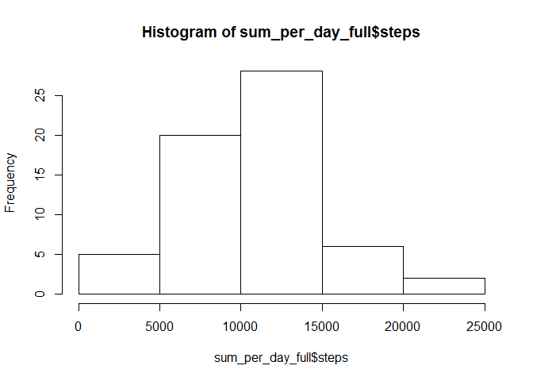
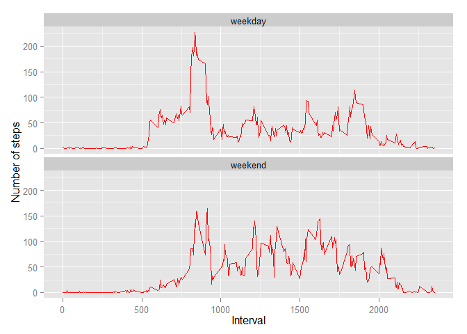

# Reproducible Research: Peer Assessment 1

## Loading and preprocessing the data


```r
library(data.table)

data <- read.table(unz("activity.zip", "activity.csv"), header=T, sep=",")
num_intervals <- length(unique(data$interval))
num_dates <- length(unique(data$date))

data$date <- as.Date(as.character(data$date))
```

## What is mean total number of steps taken per day?

#### Frequency of total number of steps taken every day


```r
data_no_na <- data[!is.na(data$steps),]
sum_per_day <- aggregate(steps ~ date, data=data_no_na, FUN=sum)

hist(sum_per_day$steps)
```

 


#### Mean of the number of steps taken every day 
 

```r
mean(sum_per_day$steps)
```

```
## [1] 10766
```
 
#### Median of the number of steps taken every day 
 

```r
median(sum_per_day$steps)
```

```
## [1] 10765
```


## What is the average daily activity pattern? 

### Time series plot of (5-minute interval, average number of steps)


```r
avg_per_interval <- aggregate(steps ~ interval, data=data_no_na, FUN=sum)
avg_per_interval$avg_steps <- avg_per_interval$steps / num_dates

plot(avg_per_interval$interval,avg_per_interval$avg_steps, type="l")
```

 

### Interval with the maximum number of steps (on average)


```r
avg_per_interval$interval[avg_per_interval$avg_steps == max(avg_per_interval$avg_steps)]
```

```
## [1] 835
```

## Imputing missing values

#### Total number of missing values 


```r
length(data$steps[is.na(data$steps)])
```

```
## [1] 2304
```

#### Devise a strategy to fill in missing values (NAs)

We replace the missing vaues with the interval averages calculated above

#### Fill NA values with average values per interval


```r
data_full <- data
data_full <- merge(data_full, avg_per_interval, by = "interval", suffixes = c("", ".y"))

nas <- is.na(data_full$steps)
data_full$steps[nas] <- data_full$avg_steps[nas]
data_full <- data_full[,c(1:3)]
```


```r
length(data$steps[is.na(data_full$steps)])
```

```
## [1] 0
```

#### Frequency of total number of steps taken every day with new dataset


```r
sum_per_day_full <- aggregate(steps ~ date, data=data_full, FUN=sum)
hist(sum_per_day_full$steps)
```

 


#### Mean of the number of steps taken every day 
 

```r
mean(sum_per_day_full$steps)
```

```
## [1] 10581
```
 
#### Median of the number of steps taken every day 
 

```r
median(sum_per_day_full$steps)
```

```
## [1] 10395
```

The mean and median does not appear to be strongly affected by our strategy of introducing average values. 

## Are there differences in activity patterns between weekdays and weekends?

#### Create a new factor variable in the dataset with two levels - "weekday" and "weekend"


```r
data_full$wk <- "weekday"
data_full$wk[weekdays(data_full$date) == "sabato" | weekdays(data_full$date) == "domenica"] <- "weekend"
```

### Time series plot of (5-minute interval, average number of steps)


```r
library(ggplot2)

avg_per_interval <- aggregate(steps ~ interval + wk, data=data_full, FUN=mean)

ggplot(avg_per_interval, aes(x=interval, y=steps)) + 
        geom_line(color="red") + 
        facet_wrap(~ wk, nrow=2, ncol=1) +
        labs(x="Interval", y="Number of steps") 
```

 
